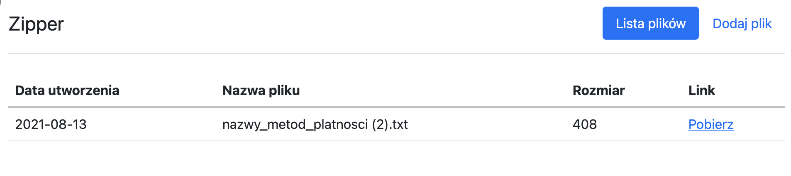

# Zipper

Zadanie rekrutacyjne na stanowisko Ruby on Rails Developer w Siepomaga.pl

Zipper to aplikacja, która pomaga w bezpiecznym przesyłaniu załączników w komunikacji mailowej. Użytkownik może w prosty sposób wrzucić jeden lub więcej plików, które zostaną skompresowane oraz zaszyfrowane przy użyciu losowego hasła. Dzięki temu użytkownik może przesłać link do załączników mailem, a hasło do odbiorcy inną metodą komunikacji (np. SMSem). 



### Wymagania techniczne

```
ruby 3.1.2
rails 7.0.2
bundler 2.3.18
```

### Uzyte biblioteki


- dotenv-rails # fetchowanie zmiennych srodowiskowych
- dry-validation # validacja body requestow
- grape # API Jsonowe
- grape-entity # serializacja responsow API
- grape-pagy # Paginacja
- 'grape-swagger', 'grape-swagger-entity', grape-swagger-rails' # Dokumentacja API + jej UI
- 'jwt' # Autoryzacja przy pomocy JWT
- 'react_on_rails' # React w railsach / budowanie widokow (frontendu)
- 'rubyzip' # Tworzenie plikow zip + szyfrowanie plikow zip
- 'sqlite3' # Baza danych

- 'rubocop' # linter
- 'rspec-rails' # pisanie testow jednostkowych / API
- 'capybara' # pisane testow systemowych
- 'rubycritic' # sprawdzanie czystosci kodu
- 'pry' # debugger
- 'simplecov' # sprawdzanie test-coverage'u
- 'database_cleaner-active_record', 'shoulda-matchers', 'factory_bot_rails' # Helpery dla testow


### Uruchomienie aplikacji

1. Upewnienie się iż plik `config/database.yml` istnieje i ma odpowiednia
konfiguracje bazy danych (przykład w pliku `config/database.example.yml`)

2. Upewnienie się iż plik `.env` istnieje i ma odpowienie zmienne srodowiskowe, ew mozna rzucic:

```
cp .env.example .env
```

3. 
```bash
bundle install
bundle exec rails db:create db:migrate
npm install
bundle exec rails s
```

4. Mozna ewentualnie rzucic seedy bazy danych
```
bundle exec rails db:seed
```

5. Dokumentacja jest dostępna po odpaleniu serwera (`bundle exec rails s`) pod `/swagger`

### Testy

- RSpec
```
bundle exec rspec
```

- Rubocop (linter)
```
bundle exec rubocop
```

- RubyCritic (clean code)
```
bundle exec rubycitic # najlepiej z argumentami app lib
```

- Rails Best Practices
```
bundle exec rails_best_practices
```

## Zadania główne

#### ZD-1

DONE: 

Po wrzuceniu pliku przez użytkownika, powinien on zostać skompresowany (zip) oraz zaszyfrowany losowym hasłem, które zostanie wyświetlone (tylko raz) użytkownikowi. Ze względów bezpieczeństwa hasło nie powinno być przechowywane w bazie danych.

#### ZD-2

DONE:

Umożliwienie dodania więcej niż jednego pliku w formularzu, które zostaną skompresowane do jednego archiwum.

#### ZD-3

DONE:

Użytkownikom zależy na prywatności, żeby nikt nie miał dostępu do ich plików. Dodaj możliwość rejestracji i logowania (jak najprościej, ale bezpiecznie, np. przy użyciu has_secure_password). Nie ma konieczności potwierdzania adresu email.

## Zadania dodatkowe

### Junior

#### ZD-4

DONE:

Niektórzy użytkownicy dodali bardzo dużą ilość plików, przez co aplikacja zrobiła się wolna oraz nieczytelna. Dodaj paginację do tabeli z plikami (przy użyciu dowolnej biblioteki).

#### ZD-5

DONE:

Przy większych plikach rozmar w bajtach jest ciężki do rozszyfrowania. Dopasuj wyświetlanie rozmaru wraz z jednostką do wielności pliku, np. (1.5Mb, 300Kb, 80B).

#### ZD-6

DONE:

Użytkownicy zgłosili, że jak zapiszą formularz bez wybrania pliku, to aplikacja przestaje działać. Sprawdź, w czym jest problem i napraw go.

### Regular / Senior

#### ZD-7

DONE:

Stwórz API JSONowe dla aplikacji, przy uzyciu biblioteki Grape API. Wymagane funkcjonalności:

* rejestracja
* logowanie
* upload plików
* lista plików

## Informacje dodatkowe

Commity powrzucałem nieco inaczej, ale wszystko jest w jednym PR, wiec mam nadzieje ze to nie problem :)
